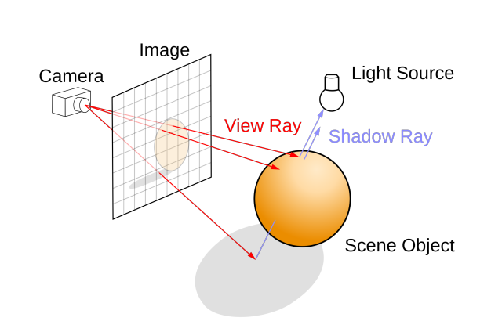

# EPITECH | B-OOP-400 | RAYTRACER


## Description

Ray tracing is a technique used to generate realistic digital images by simulating the inverse path of light.
Goal of this project is to create a program able to generate an image from a file describing the scene.

<p align="center">
    
</p>

## Prerequisites

- CMake 3.27
- C++20
- libconfig++
- SFML 2.5.1


## Usage


### Build

```bash
$> ./build.sh build
[...]
```


### Launch RayTracer

```bash
$> ./raytracer <SCENE_FILE>
[...]
```


## Architecture

```
    RayTracer/
    │
    │─ .github/workflows/       Workflows
    │
    │─ cmake/modules/           cmake modules
    │
    │─ doc/                     Documentation
    │
    └─
```


## Commit Norms

| Commit Type | Description                                                                                                               |
|:------------|:--------------------------------------------------------------------------------------------------------------------------|
| build       | Changes that affect the build system or external dependencies (npm, make, etc.)                                           |
| ci          | Changes related to integration files and scripts or configuration (Travis, Ansible, BrowserStack, etc.)                   |
| feat        | Addition of a new feature                                                                                                 |
| fix         | Bug fix                                                                                                                   |
| perf        | Performance improvements                                                                                                  |
| refactor    | Modification that neither adds a new feature nor improves performance                                                     |
| style       | Change that does not affect functionality or semantics (indentation, formatting, adding space, renaming a variable, etc.) |
| docs        | Writing or updating documentation                                                                                         |
| test        | Addition or modification of tests                                                                                         |


## Contributors
- [Elliot Masina](https://github.com/bobis33)
- [Jules Sourbets](https://github.com/wwLeji)
- [Paul Ragueneau](https://github.com/Periicles)
- [Tristan Le Du](https://github.com/ShrimpPR)